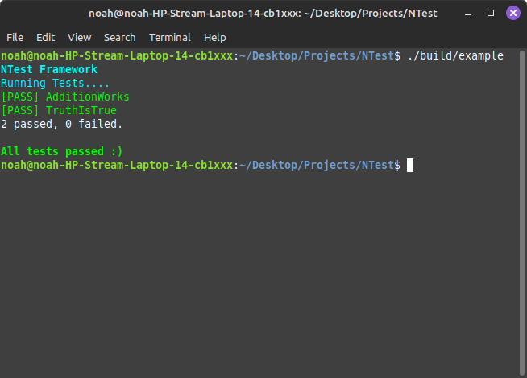

# NTest – Minimal C++ Unit Testing Framework

[](https://github.com/NoahGWood/NTest/actions/workflows/ci.yaml) [](https://github.com/NoahGWood/NTest/issues) []() [](https://github.com/NoahGWood/NTest)


**NTest** is a lightweight, single-header unit testing framework for C++ projects.  
Inspired by simplicity, designed for speed, and pretty enough for your terminal.

---

## Features

- Single header with minimal code
- Automatic test registration
- Simple assertion macros
- Colored terminal output (via [NCLI](https://github.com/NoahGWood/NCLI))
- Optional `main()` generation with `#define NTEST_MAIN`

---

## Dependency

Requires the `Colors` header from the [NCLI](https://github.com/NoahGWood/NCLI) library for styled terminal output.

---

## Usage

### 1. Create a test file

```cpp
#define NTEST_MAIN
#include "NTest.h"

TEST(MyFirstTest) {
    ASSERT_TRUE(1 + 1 == 2);
    ASSERT_EQ("hello", std::string("hello"));
}
```

### 2. Compile and run

```sh
g++ my_tests.cpp -o tests && ./tests
```

---

## Assertions

```cpp
ASSERT_TRUE(cond)
ASSERT_FALSE(cond)
ASSERT_EQ(a, b)
ASSERT_NE(a, b)
ASSERT_LT(a, b)
ASSERT_GT(a, b)
ASSERT_LE(a, b)
ASSERT_GE(a, b)
ASSERT_THROW(code)

EXPECT_EQ(a, b)     // Non-terminating
EXPECT_TRUE(cond)   // Non-terminating
```

---

## Example Output




---

## License

[TBD]

